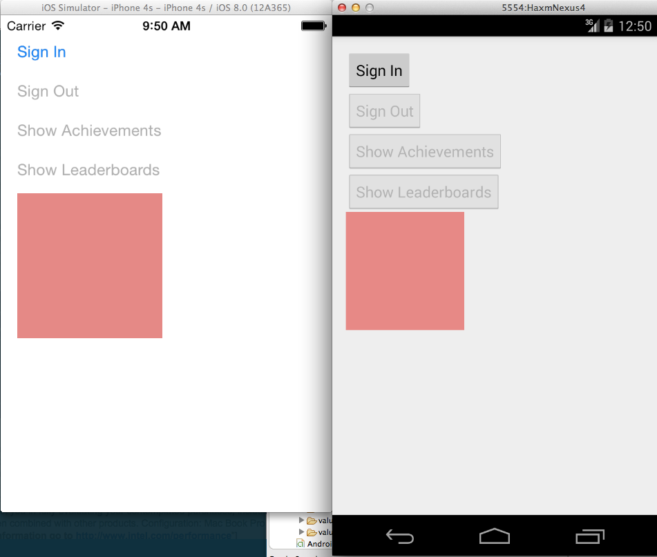

# ComboSample

## Introduction
This sample demonstrates building an app with Google Play Games on iOS and Android with a single C++ code base.

## Project Structure

* **android/** - All Android-specific code, including JNI code.
    * **src/** - Java source code.
        * **MainActivity.java** - Main `Activity` for the application.  Uses the JNI to call the C++ SDK for sign-in, leaderboards, etc.
    * **jni/** - JNI source code, including C++ headers for native methods in the Java source.
        * **AndroidMain.cpp** - Android-specific lifecycle methods for initializing Google Play Games.
        * **MainActivity.cpp** - implementation of native methods in `MainActivity.java`.
        * **GLRenderer.cpp** - implementation of native methods in `GLRenderer.java`.
    * **make_headers.sh** - script to generate headers for native methods in Java classes.
* **ios/** - All iOS-specific code.
    * **ComboSample/ComboSample/** - main iOS app project.
        * **ViewController.mm** - Main `ViewController` for the application.  Uses Objective-C++ to call the C++ SDK for sign-in, leaderboards, etc.
* **cpp/** - All shared C++ code.
    * **StateManager.cpp** - code for interacting with Google Play Games. 
    * **GLDrawer.cpp** - OpenGL code to render the `GLKView` in iOS and the `GLSurfaceView` in Android.
    * **logging.h** - defines cross-platform `LOGI(...)` macro to use `NSLog(...)` on iOS and `Log.i(...)` on Android.
    
## Set-up

### Requirements

* [Android NDK Revision 9d or higher](https://developer.android.com/tools/sdk/ndk/index.html)
* [Android SDK v10 or higher and latest Eclipse ADT](https://developer.android.com/sdk/index.html)
* [The latest version of the Google Play Services SDK](http://developer.android.com/google/play-services/setup.html)
* [The Play Games C++ SDK](https://developers.google.com/games/services/downloads/)
* [Cocoapods](https://cocoapods.org)

### Google Play Games

1. Create an entry for your game in the Google Play Developer Console by following [these instructions](https://devsite.googleplex.com/games/services/console/enabling).
1. Link an Android app and an iOS app to your project.  For Android use the package name `com.google.example.combosample`.  For iOS use the Bundle Identifier `com.google.example.ComboSample`.  Make sure to keep track of your App ID and the Client ID for your iOS app, you will need these later.
1. Download the Play Games C++ SDK and extract it to a directory on your development machine.

### Android

1. In your local development environment, set the following variables:
    1. `SDK_ROOT` - the location of your Android SDK folder.  Add `SDK_ROOT/tools` and `SDK_ROOT/platform-tools` to your `PATH`.
    1. `NDK_ROOT` - the location of your Android NDK folder.  Add `NDK_ROOT` to your `PATH`.
    1. `NDK_MODULE_PATH` - the location of the folder containing the Play Games C++ SDK folder.  This is **not** the location of the C++ SDK but rather the directory above it.
1. Import the project into Eclipse:
    1. Click **File > Import > Android > Existing Android Code into Workspace**.
    1. Select the `android` directory of this sample and click **OK**.
1. Import the Appcompat v7 library:
    1. Click **File > Import > Android > Existing Android Code into Workspace**.
    1. Select the `SDK_ROOT/extras/android/support/v7/appcompat` folder and click **OK**.
    1. Right click the `ComboSample` project and select **Properties > Android** and add a Library reference to the `android-support-v7-appcompat` project that you just imported.   Remove any pre-existing broken Library references.
1. Import the Google Play Services library:
    1. Click **File > Import > Android > Existing Android Code into Workspace**.
    1. Select the `SDK_ROOT/extras/google/google_play_services/libproject` folder and click **OK**.
    1. Right click the `ComboSample` project and select **Properties > Android** and add a Library reference to the `google_play_services-lib` project that you just imported.
1. In `android/res/values/ids.xml` replace the `app_id` value with your App ID from the Google Play Developers Console.

### iOS

1. Navigate to the `ios/ComboSample` directory and run `pod install`.  This uses cocoapods to install the latest version of the Play Games SDK for iOS.
1. Open the file `ComboSample.xckworkspace` which was generated by the previous command.  This should open XCode with the ComboSample project.
1. Under **Build Settings > Framework Search Paths** add an entry to `SDK_PATH/ios` where `SDK_PATH` is the path to the Play Games C++ SDK folder (`gpg-cpp-sdk`) on your machine.  If you followed the instructions for Android this should be equivalent to `NDK_MODULE_PATH/gpg-cpp-sdk/ios`.
1. In `ViewController.mm` change the value of `kClientID` to the iOS client ID you obtained earlier.

## Build and Run

1. To build the C++ code for use with the Android NDK, navigate to the `android/jni` directory and run `ndk-build`.
1. Run the Android app on a physical Android device with Android 2.3.3 or later and Google Play Services installed.
1. Run the iOS app on a physical iOS device or simulator with iOS 7.0 or later.
1. When running the app, you should see four buttons (Sign In, Sign Out, Show Achievements, and Show Leaderboards) as well as a colored square.  The four buttons trigger methods in the Play Games SDK and the square is a demonstration of using OpenGL graphics in a cross-platform application.  See the screenshot below:

    
